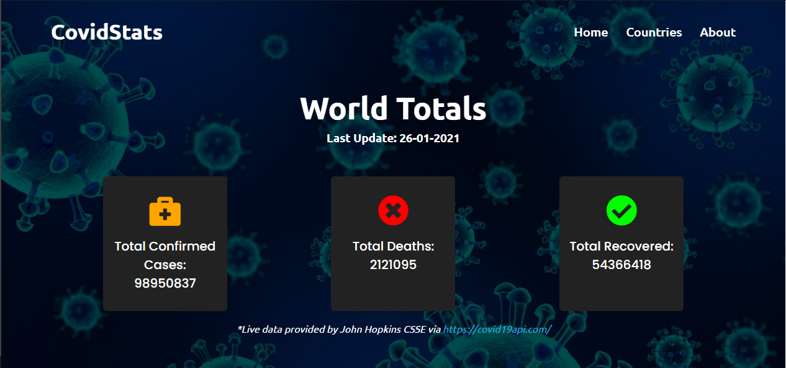
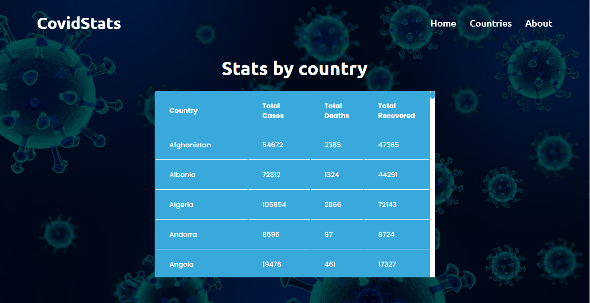

# **CovidData - The latest Covid statistics**
A responsive webapp which uses the Covid19api.com API to provide a simple and quick live update with the latest worldwide Coronavirus statistics.

## Table of contents
---
* [Demo](#Demo)
* [Site](#Site)
* [Technologies](#Technologies)

## **Demo**
---
Here is a working live demo: 

### **Site**
---
**Landing Page**

The homepage shows a live view of the total latest worldwide Covid cases, deaths & recoveries

**Countries Page**

This page provides a live a table of each individual country and their current cases, deaths and recoveries

## Technologies
---
* [NodeJs](https://nodejs.org/) - Node.js is an open-source, cross-platform, back-end JavaScript runtime environment that runs on the Chrome V8 engine and executes JavaScript code outside a web browser.
* [Express](https://expressjs.com/) - Express.js, or simply Express, is a back end web application framework for Node.js
* [Axios](https://github.com/axios/axios) - Promise based HTTP client for the browser and node.js
* [EJS](https://ejs.co/) - EJS is a simple templating language that lets you generate HTML markup with plain JavaScript. 
